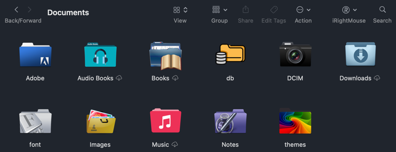

# Mac Folder Icon Manager (Mac文件夹图标管理器)


  
A simple yet practical Mac folder icon management application that allows you to easily change folder icons.   
一个简单而实用的Mac文件夹图标管理应用程序，让您可以轻松地更改文件夹的图标。  


I don't understand why this kind of software still needs to be paid for, so we can only make one ourselves (of course, with the help of AI's powerful force).  
不懂为什么这种软件还要付费，只好我们手撸一个(当然借助AI的强大力量)。


## Features (功能)

Effect Display 效果展示 

### Change Icon (换图标)

- Built-in variety of beautiful folder icons
- Icon search functionality by name or keywords
- Support for drag-and-drop custom icons (PNG, JPG, and SVG formats)
- Support for downloading icons from URL
- Clean and user-friendly interface
- Supports both Chinese and English interfaces

---

- 内置多种漂亮的文件夹图标
- 支持图标搜索功能，可按名称或关键词查找
- 支持拖放上传自定义图标（支持PNG、JPG和SVG格式）
- 支持从URL下载图标
- 简洁友好的用户界面
- 支持中英文界面

### Icon Backup Management (图标备份管理)

- Icon replacement information data is saved locally (can use iCloud folder for cloud synchronization)
- One-click restore icon settings from local (or iCloud)
- Place icons in the source-icons directory under the working directory, the program will automatically load these icons

---

- 图标替换信息数据保存本地(可使用icloud文件夹保持云同步)
- 一键从本地（或icloud）恢复图标设置
- 存入图标到 工作目录下source-icons 目录，程序会自动加载这批图标


## Change Icon Usage (换图标使用方法)

1. **Select Icon**:
   - Choose an icon from the default icon library
    
   - Use custom icons: download, upload, or add an image from a URL
   


2. **Select Folder**:
   - Method 1: Drag and drop the target folder into the designated area
   - Method 2: Click the button to select a folder from Finder

3. **Apply Icon**:
   - Click the "Apply Icon to Folder" button to complete the icon change


--- 
1. **选择图标 (Select Icon)**：
   - 从默认图标库中选择一个图标
     
   - 使用自定义图标：下载、上传或从URL添加图片
     

2. **选择文件夹**：
   - 方法1：将目标文件夹拖放到指定区域
   - 方法2：点击按钮从Finder选择文件夹
   
3. **应用图标**：
   - 点击"应用图标到文件夹"按钮，即可完成图标更换

## AI-powered Icon Scrawler (ICON图片抓取和分析工具)


**[Folder Icon Scrawl and Annotation Tool 文件夹图片爬虫和标注工具](https://github.com/tigerai-tech/folder-icon-annotation.git)**

We also provide a crawler and analysis to help you scrape more beautiful images from websites.  
我们也提供了一个爬虫和分析， 帮助你从网站上抓取更多的漂亮图片。  

Provide the following capabilities：
- Image crawler
- Folder icon recognition (binary classification: yes/no)
- Labeling folder icons for search

提供以下能力：  
- 图片爬虫
- 文件夹图标识别(二分类：是/否)
- 为文件夹图标贴标签，用于搜索


## Build from Source  (从源代码构建)

```bash
# 安装依赖
pnpm install

# 开发环境运行
pnpm dev

# 构建应用程序
pnpm build

# 构建macOS应用
pnpm build:mac
```

## Tech Stack (技术栈)

- Electron
- Vue 3
- TypeScript
- Ant Design Vue
- fileicon (for Mac folder icon modification / 用于Mac文件夹图标修改)

## Notes (注意事项)

This application requires permissions to modify folder icons, so you may be asked to provide system permissions during use.  

此应用需要权限来修改文件夹图标，因此在使用过程中可能会要求您提供系统权限。


## Need your support (感谢支持)

- Feel free to raise an Issue directly for any questions or requests
- Please help by starring, your support is the greatest motivation for open source creation
---
- 有问题或需求直接提Issue
- 请帮忙加星， 你的支持是开源创作的最大动力

## License (许可)

[MIT License](LICENSE)
